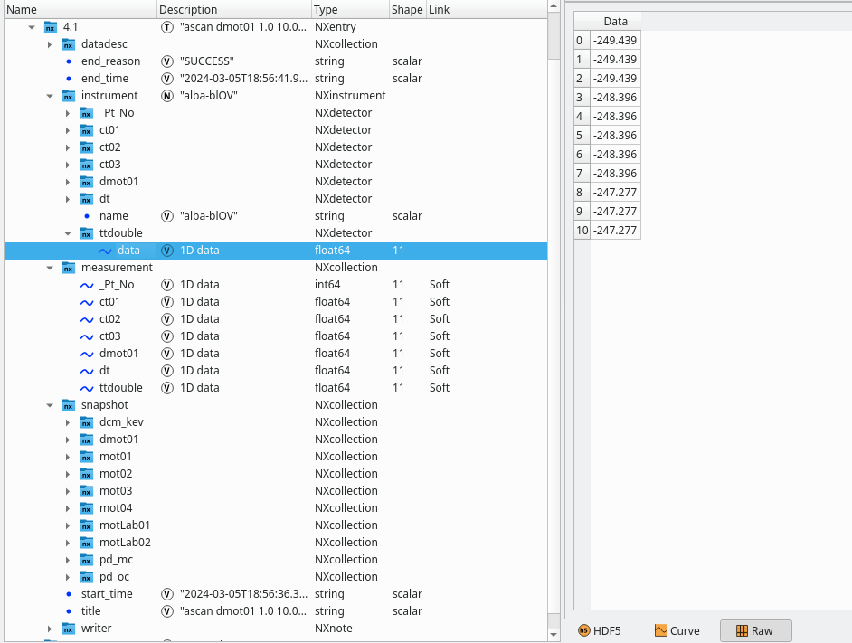

## Sardana Redis BlissData 1.0 Recorder

This is a Proof of Concept to use [BlissData 1.0](https://bliss.gitlab-pages.esrf.fr/bliss/master/blissdata/intro.html) as a [Sardana](https://gitlab.com/sardana-org/sardana) recorder. It consists of a basic recorder that stores the scan data (only counters for now) and which can use the Nexus Writer provided in [Bliss](https://bliss.gitlab-pages.esrf.fr/bliss/master/) to write nexus files.

### Installation
The requirements to test the [Sardana Redis BlissData 1.0 Recorder](./sardana_redis-10/recorder/redis_bliss_recorder.py) are [Sardana](https://gitlab.com/sardana-org/sardana) (obviously), a Redis database and the [Blissdata 1.0](https://gitlab.esrf.fr/bliss/bliss/-/tree/blissdata-1.0.0rc0/blissdata) module.

A local redisDB can be started from the provided [docker compose file](./docker-compose.yaml). The [blredis.conf](./blredis.conf) configuration will be used and the DB will be exposed in `localhost:6379`.

Install the plugin from the setup.py file and edit the Sardana Macroserver RecorderPath property to point to the folder where the RedisBlissRecorder is.

### Usage
The recorder can be activated by setting it in spock with the command `senv DataRecorder "RedisBlissRecorder"`

By default, `localhost:6379` will be used as the redisDB but a custom url can be set in the RedisURL sardana environemnt variable, e.g. `senv RedisURL "redis://localhost:6379"`

After performing a scan, the data will be stored in the RedisDB. For example, after the following scan:

```python
Door_macroserver_1 [83]: ascanct mot04 1 10 10 .1 .2
Scan #123 started at Fri Nov 17 16:17:56 2023. It will take at least 0:00:00
Motor positions and relative timestamp (dt) columns contains theoretical values

 Motor   Velocity[u/s]   Acceleration[s]   Deceleration[s]    Start[u]   End[u] 
 mot04         3                2                 2              -2       13.9  

 #Pt No    mot04      ct01      ct02      ct03      ct04       dt   
   0         1        0.1       0.2       0.3       0.4        2    
   1        1.9       0.1       0.2       0.3       0.4       2.3   
   2        2.8       0.1       0.2       0.3       0.4       2.6   
   3        3.7       0.1       0.2       0.3       0.4       2.9   
   4        4.6       0.1       0.2       0.3       0.4       3.2   
   5        5.5       0.1       0.2       0.3       0.4       3.5   
   6        6.4       0.1       0.2       0.3       0.4       3.8   
   7        7.3       0.1       0.2       0.3       0.4       4.1   
   8        8.2       0.1       0.2       0.3       0.4       4.4   
   9        9.1       0.1       0.2       0.3       0.4       4.7   
   10        10       0.1       0.2       0.3       0.4        5    
Overshoot was corrected
Scan #123 ended at Fri Nov 17 16:18:14 2023, taking 0:00:17.112891. Dead time 98.8% (setup time 1.2%, motion dead time 98.8%)
```

We can check that the data is in the redisDB with any viewer:


But data can be easily accessed via blissdata, as it is explained in [blissdata documentation](https://bliss.gitlab-pages.esrf.fr/bliss/master/blissdata/getting_started.html). Existing scans can searched by its properties or be loaded by their keys. Blissdata can also wait for the next scans or load the last one collected. Then it is straightforward to get the data from the streams, for example:

```
In [1]: from blissdata.redis_engine.store import DataStore

In [2]: from blissdata.redis_engine.exceptions import NoScanAvailable

In [3]: data_store = DataStore("redis://localhost:6379")

In [4]: try:
   ...:     timestamp, key = data_store.get_last_scan()
   ...: except NoScanAvailable:
   ...:     raise Exception("There is no scan at all !")
   ...: scan = data_store.load_scan(key)

In [5]: scan.name
Out[5]: 'a1scanct'

In [6]: scan.number
Out[6]: 124

In [7]: scan.streams
Out[7]: 
{'mot04': <blissdata.redis_engine.stream.Stream at 0x7f4c4c077a00>,
 'ct01': <blissdata.redis_engine.stream.Stream at 0x7f4c4c0771c0>,
 'ct02': <blissdata.redis_engine.stream.Stream at 0x7f4cb3f0c490>,
 'ct03': <blissdata.redis_engine.stream.Stream at 0x7f4c4c8b9d90>,
 'ct04': <blissdata.redis_engine.stream.Stream at 0x7f4cb3f00b80>,
 'dt': <blissdata.redis_engine.stream.Stream at 0x7f4cb3f00550>}

In [8]: ct03 = scan.streams['ct03']

In [9]: ct03[4]  # e.g. this is point 4 of the scan
Out[9]: 0.30000000000000004
```

### Data Structure

You can find a very nice description of how the data is stored in [Bliss](https://bliss.gitlab-pages.esrf.fr/bliss/master/) documentation.


### Bliss Nexus Writer

With Blissdata is easy to extract the data from the Redis DB so it could be used by external services to write files on storage, "online" data processing, etc... Bliss offers a tango device called Nexus Writer. This writer has been tested to see if it could be used with the data published on the redis DB via BlissData 1.0 from Sardana. The Nexus Writer is available in Bliss so to use it, Bliss needs to be [installed](https://bliss.gitlab-pages.esrf.fr/bliss/master/installation.html).

The TANGO device is launched with the command `NexusWriterService` but before it needs to be registered and linked to the session where it will be used. In the current Proof of Concept, the session name used by the sardana recorder is "test_session" so this is the name of the session propety that needs to be set to the device.


When everything is ready, start the device server 

```bash
NexusWriterService nexuswriters --log=info
```
Then, to set path where the nexus files will be saved, set the `ScanDir` and `ScanFile` sardana environment variables accordingly. For example:

```python
Door_macroserver_1 [87]: lsenv
                  Name                                                          Value   Type
 --------------------- -------------------------------------------------------------- ------
              RedisURL                                         redis://localhost:6379    str
               ScanDir                                                           /tmp    str
              ScanFile                                       ['test_nexus_writer.h5']   list
                ScanID                                                            123    int
          ScanRecorder                                         ['RedisBlissRecorder']   list
```

Then after the scan (if the device server is running and the session is properly set), the file will be automatically written.



