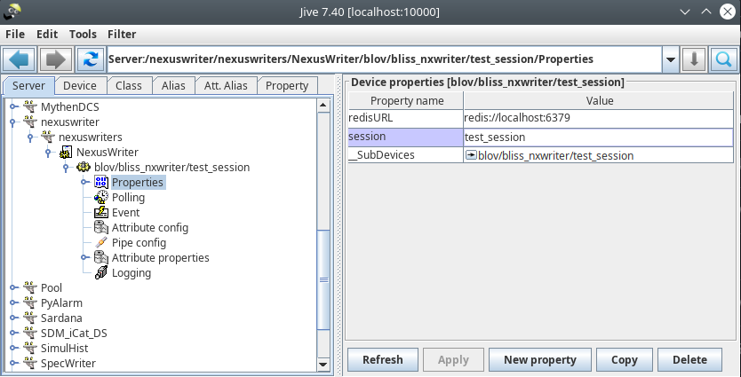

## Sardana Redis BlissData 1.0 Recorder

This is a Proof of Concept to use [BlissData 1.0](https://bliss.gitlab-pages.esrf.fr/bliss/master/blissdata/intro.html) as a [Sardana](https://gitlab.com/sardana-org/sardana) recorder. It consists of a basic recorder that stores the scan data (only counters for now) and which can use the Nexus Writer provided in [Bliss](https://bliss.gitlab-pages.esrf.fr/bliss/master/) to write nexus files.

### Installation
The requirements to test the [Sardana Redis BlissData 1.0 Recorder](./sardana_redis/recorder/redis_bliss_recorder.py) are [Sardana](https://gitlab.com/sardana-org/sardana) (obviously), a Redis database and the [Blissdata 1.0](https://gitlab.esrf.fr/bliss/bliss/-/tree/blissdata-1.0.0rc0/blissdata) module.

A local redisDB can be started from the provided [docker compose file](./docker-compose.yaml). The [blredis.conf](./blredis.conf) configuration will be used and the DB will be exposed in `localhost:6379`.

Install the plugin from the setup.py file and edit the Sardana Macroserver RecorderPath property to point to the folder where the RedisBlissRecorder is.

After initializing the database (if not done manually it will be after first Sardana scan), run the memory_tracker process to monitor the database and clear space when necessary:

```bash
$> memory_tracker --redis-url redis://localhost:6379
2023-12-14 17:42:35,121 INFO: INIT | Redis max. memory: 4GB
2023-12-14 17:42:35,121 INFO: INIT | Mem. usage to trigger cleanup: 80% (3.2GB)
2023-12-14 17:42:35,121 INFO: INIT | Protected history length: 180 seconds
2023-12-14 17:42:35,146 INFO: Scan esrf:scan:01HHMHGD8J5HH0BPMW9P6K5XQF is terminated, expiration set to 7 days, 0:00:00 seconds
2023-12-14 17:42:35,148 INFO: Scan esrf:scan:01HHMJFBYYY730099KMZJV395T is terminated, expiration set to 7 days, 0:00:00 seconds
2023-12-14 17:42:35,149 INFO: Scan esrf:scan:01HHMJ1Z81HB230TRJ3PQ8BFKE is terminated, expiration set to 7 days, 0:00:00 seconds
2023-12-14 17:42:35,150 INFO: Scan esrf:scan:01HHMJ3EPH9VKX0V1TEBPBJAET is terminated, expiration set to 7 days, 0:00:00 seconds
2023-12-14 17:42:35,152 INFO: Scan esrf:scan:01HHMJBBPCXW3Y93GJ7M9FGG8D is terminated, expiration set to 7 days, 0:00:00 seconds
2023-12-14 17:42:35,153 INFO: Scan esrf:scan:01HHMJ07B2YNJA5658QSZ3GQ9R is terminated, expiration set to 7 days, 0:00:00 seconds
2023-12-14 17:42:35,154 INFO: Scan esrf:scan:01HHMHW2W61C921M6PRPT0HJHQ is terminated, expiration set to 7 days, 0:00:00 seconds
2023-12-14 17:42:35,156 INFO: Scan esrf:scan:01HHMDM5EGB58BK4XG31NP43SB is terminated, expiration set to 7 days, 0:00:00 seconds
2023-12-14 17:42:35,156 INFO: Memory usage: 2.531MB
```

### Usage
The recorder can be activated by setting it in spock with the command `senv ScanRecorder "RedisBlissRecorder"`

By default, `localhost:6379` will be used as the redisDB but a custom url can be set in the RedisURL sardana environemnt variable, e.g. `senv RedisURL "redis://localhost:6379"`

After performing a scan, the data will be stored in the RedisDB. For example, after the following scan:

```python
Door_macroserver_1 [83]: ascanct mot04 1 10 10 .1 .2
Scan #123 started at Fri Nov 17 16:17:56 2023. It will take at least 0:00:00
Motor positions and relative timestamp (dt) columns contains theoretical values

 Motor   Velocity[u/s]   Acceleration[s]   Deceleration[s]    Start[u]   End[u] 
 mot04         3                2                 2              -2       13.9  

 #Pt No    mot04      ct01      ct02      ct03      ct04       dt   
   0         1        0.1       0.2       0.3       0.4        2    
   1        1.9       0.1       0.2       0.3       0.4       2.3   
   2        2.8       0.1       0.2       0.3       0.4       2.6   
   3        3.7       0.1       0.2       0.3       0.4       2.9   
   4        4.6       0.1       0.2       0.3       0.4       3.2   
   5        5.5       0.1       0.2       0.3       0.4       3.5   
   6        6.4       0.1       0.2       0.3       0.4       3.8   
   7        7.3       0.1       0.2       0.3       0.4       4.1   
   8        8.2       0.1       0.2       0.3       0.4       4.4   
   9        9.1       0.1       0.2       0.3       0.4       4.7   
   10        10       0.1       0.2       0.3       0.4        5    
Overshoot was corrected
Scan #123 ended at Fri Nov 17 16:18:14 2023, taking 0:00:17.112891. Dead time 98.8% (setup time 1.2%, motion dead time 98.8%)
```

We can check that the data is in the redisDB with any viewer:


But data can be easily accessed via blissdata, as it is explained in [blissdata documentation](https://bliss.gitlab-pages.esrf.fr/bliss/master/blissdata/getting_started.html). Existing scans can searched by its properties or be loaded by their keys. Blissdata can also wait for the next scans or load the last one collected. Then it is straightforward to get the data from the streams, for example:

```
In [1]: from blissdata.redis_engine.store import DataStore

In [2]: from blissdata.redis_engine.exceptions import NoScanAvailable

In [3]: data_store = DataStore("redis://localhost:6379")

In [4]: try:
   ...:     timestamp, key = data_store.get_last_scan()
   ...: except NoScanAvailable:
   ...:     raise Exception("There is no scan at all !")
   ...: scan = data_store.load_scan(key)

In [5]: scan.name
Out[5]: 'a1scanct'

In [6]: scan.number
Out[6]: 124

In [7]: scan.streams
Out[7]: 
{'mot04': <blissdata.redis_engine.stream.Stream at 0x7f4c4c077a00>,
 'ct01': <blissdata.redis_engine.stream.Stream at 0x7f4c4c0771c0>,
 'ct02': <blissdata.redis_engine.stream.Stream at 0x7f4cb3f0c490>,
 'ct03': <blissdata.redis_engine.stream.Stream at 0x7f4c4c8b9d90>,
 'ct04': <blissdata.redis_engine.stream.Stream at 0x7f4cb3f00b80>,
 'dt': <blissdata.redis_engine.stream.Stream at 0x7f4cb3f00550>}

In [8]: ct03 = scan.streams['ct03']

In [9]: ct03[4]  # e.g. this is point 4 of the scan
Out[9]: 0.30000000000000004
```

### Data Structure

You can find a very nice description of how the data is stored in [Bliss](https://bliss.gitlab-pages.esrf.fr/bliss/master/) documentation.


### Bliss Nexus Writer

With Blissdata is easy to extract the data from the Redis DB so it could be used by external services to write files on storage, "online" data processing, etc... Bliss offers a tango device called Nexus Writer. This writer has been tested to see if it could be used with the data published on the redis DB via BlissData 1.0 from Sardana. The Nexus Writer is available in Bliss so to use it, Bliss needs to be [installed](https://bliss.gitlab-pages.esrf.fr/bliss/master/installation.html).

The TANGO device is launched with the command `NexusWriterService` but before it needs to be registered and linked to the session where it will be used. In the current Proof of Concept, the session name used by the sardana recorder is "test_session" so this is the name of the session propety that needs to be set to the device.



When everything is ready, start the device server 

```bash
NexusWriterService nexuswriters --log=info
```
Then, to set path where the nexus files will be saved, set the `ScanDir` and `ScanFile` sardana environment variables accordingly. For example:

```python
Door_macroserver_1 [87]: lsenv
                  Name                                                          Value   Type
 --------------------- -------------------------------------------------------------- ------
              RedisURL                                         redis://localhost:6379    str
               ScanDir                                                           /tmp    str
              ScanFile                                       ['test_nexus_writer.h5']   list
                ScanID                                                            123    int
          ScanRecorder                                         ['RedisBlissRecorder']   list
```

Then after the scan (if the device server is running and the session is properly set), the file will be automatically written.


### Basic Spec Writer Example

A very simple spec writer as a writer client example is provided as a [standalone process](./sardana_redis/spec_writer/spec_writer_service.py) or as a [tango device](./sardana_redis/spec_writer/spec_writer_tango.py).

After registering it to a tangoDB with <instance_name> the following properties can be defined:

Three properties can be defined:
- redis_url: Redis DB url (default='redis://localhost:6379')
- log_level: Log level of spec_writer_service (default='INFO')
next_scan_timeout: Timeout for get_next_scan calls. Use 0 for blocking calls. The only drawback is that blocking prevents stopping the service from the tango device at a specific moment (it will be applied after the following scan) (default=2)

And it can be started normally as (e.g. specwriter instance name):

```bash
python spec_writer_tango.py specwriter -v4
2023-12-21T17:10:51,766524+0100 INFO (spec_writer_tango.py:18) blov/spec_writer/test Initializing device...
2023-12-21 17:10:51,766 - sardana_redis.spec_writer.spec_writer_service - INFO - Connecting to DB
2023-12-21 17:10:51,771 - sardana_redis.spec_writer.spec_writer_service - INFO - Waiting for scan
Ready to accept request
Processing scan esrf:scan:01HJ6JG89DE0Z2Z2A2KMDPRM3H
2023-12-21 17:14:26,842 - sardana_redis.spec_writer.spec_writer_service - INFO - recording into '/tmp/scans/test_spec_writer.dat'
2023-12-21 17:14:43,680 - sardana_redis.spec_writer.spec_writer_service - WARNING - End of stream for scalar column #Pt No
2023-12-21 17:14:43,690 - sardana_redis.spec_writer.spec_writer_service - INFO - finished recording to '/tmp/scans/test_spec_writer.dat'
2023-12-21 17:14:43,690 - sardana_redis.spec_writer.spec_writer_service - INFO - Waiting for next scan
```

And data will be written/appended to the file in spec format:

```
#S 74 ascanct mot04 1.0 10.0 10 0.1 0.2
#D 2023-12-21T17:14:26.605568+01:00
#C Acquisition started at 2023-12-21T17:14:26.605568+01:00
#O0 dcm_kev  dmot01  mot01  mot02  mot03  mot04  motLab01  motLab02
#O1 motLab03  pd_mc  pd_oc
#P0 0.0 0.0 0.0 0.0 0.0 10.0 -137136.0 1000.0
#P1 2000.0 0.0 0.0
#N 7
#@MCA 1024
#@CHANN 1024 0 1023 1
#@MCA_NB 1
#@DET_0 oned01
#L #Pt_No  mot04  ct01  ct02  ct03  ct04  dt
@A 2.9802322387695314e-09 3.188948758273692e-09 3.4118304746830744e-09 ...
0 1.0 0.1 0.2 0.30000000000000004 0.4 2.0                              
@A 2.9802322387695314e-09 3.188948758273692e-09 3.4118304746830744e-09 ...
1 1.9 0.1 0.2 0.30000000000000004 0.4 2.3                              
@A 2.9802322387695314e-09 3.188948758273692e-09 3.4118304746830744e-09 ...
2 2.8 0.1 0.2 0.30000000000000004 0.4 2.5999999999999996               
@A 2.9802322387695314e-09 3.188948758273692e-09 3.4118304746830744e-09 ...
3 3.7 0.1 0.2 0.30000000000000004 0.4 2.8999999999999995               
@A 2.9802322387695314e-09 3.188948758273692e-09 3.4118304746830744e-09 ...
4 4.6 0.1 0.2 0.30000000000000004 0.4 3.1999999999999993               
@A 2.9802322387695314e-09 3.188948758273692e-09 3.4118304746830744e-09 ...
5 5.5 0.1 0.2 0.30000000000000004 0.4 3.499999999999999                
@A 2.9802322387695314e-09 3.188948758273692e-09 3.4118304746830744e-09 ...
6 6.4 0.1 0.2 0.30000000000000004 0.4 3.799999999999999                
@A 2.9802322387695314e-09 3.188948758273692e-09 3.4118304746830744e-09 ...
7 7.3 0.1 0.2 0.30000000000000004 0.4 4.099999999999999                
@A 2.9802322387695314e-09 3.188948758273692e-09 3.4118304746830744e-09 ...
8 8.2 0.1 0.2 0.30000000000000004 0.4 4.399999999999999                
@A 2.9802322387695314e-09 3.188948758273692e-09 3.4118304746830744e-09 ...
9 9.1 0.1 0.2 0.30000000000000004 0.4 4.699999999999998                
@A 2.9802322387695314e-09 3.188948758273692e-09 3.4118304746830744e-09 ...
10 10.0 0.1 0.2 0.30000000000000004 0.4 4.999999999999998
#C Acquisition ended 2023-12-21T17:14:43.687924+01:00
```


